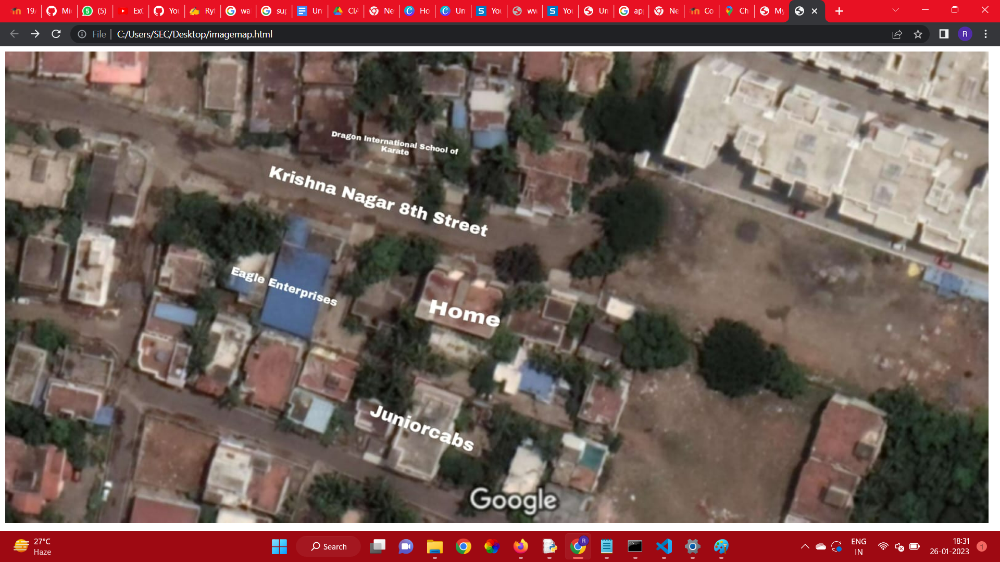
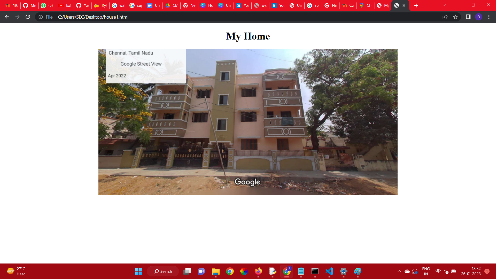
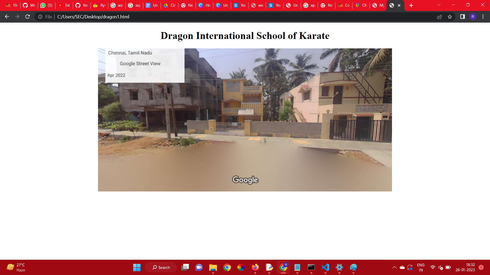
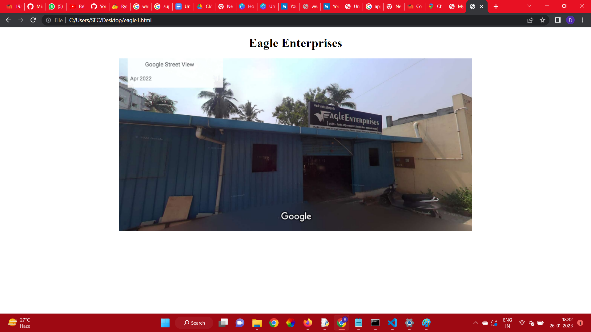
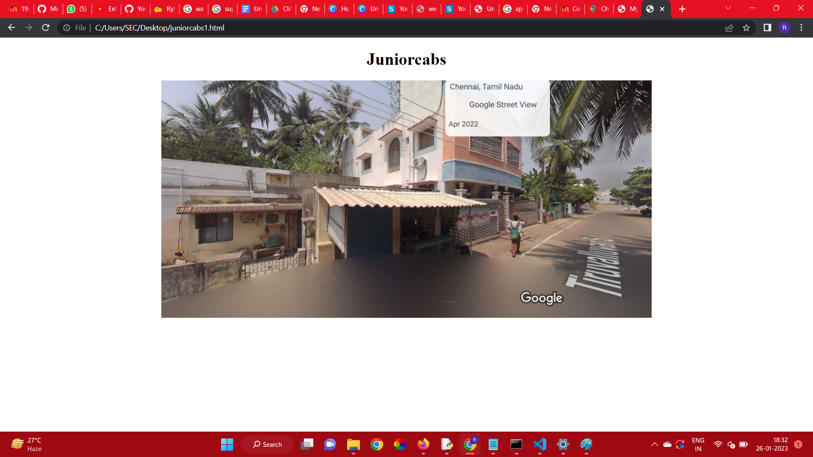

# Places Around Me
# Aim:
To develop a website to display details about the places around my house.

# Design Steps:
## Step 1
Create the main html page that contains the image-mapping.

## Step 2
Use the paint softwere to obtain the coordinates of the special area, which is going to redirect to another html page.


## Step 3
Create the other html pages that are going to be linked with the main html page.


# Code:
```
imagemap.html

<!DOCTYPE html>
<html lang="en">
<head>
<title>My Area</title>
</head>
<body>
    
        <div >
        
        <map name="MyArea">
        <area shape="rect" coords="411,183,786,312" href="krishna_nagar.html"  title="Krishna Nagar 8th Street">
        <area shape="rect" coords="679,388,815,469" href="house1.html"  title="Home">
        <area shape="rect" coords="359,344,555,432" href="eagle1.html"  title="Eagle Enterprises">
        <area shape="rect" coords="515,114,762,175" href="dragon1.html"  title="Dragon International School of Karate">
        <area shape="rect" coords="589,564,775,671" href="juniorcabs1.html"  title="Juniorcabs">
        
        </map>
        </div>
        
</body>
```
```
krishna_nagar.html


<!DOCTYPE html>
<html lang="en">
<head>
<title>Krishna Nagar 8th Street</title>
</head>
<body>
    <center>
        <h1>Krishna Nagar 8th Street</h1>
        
    </center>
    

</body>
</html>
```
```


house1.html


<!DOCTYPE html>
<html lang="en">
<head>
<title>My Home</title>
</head>
<body>
    <center>
        <h1>My Home</h1>
    
    </center>

</body>
</html>
```
```

eagle1.html


<!DOCTYPE html>
<html lang="en">
<head>
<title>Eagle Enterprises</title>
</head>
<body>
    <center>
        <h1>Eagle Enterprises</h1>
    
    </center>

</body>
</html>
```
```


dragon1.html


<!DOCTYPE html>
<html lang="en">
<head>
<title>Dragon International School of Karate</title>
</head>
<body>
    <center>
        <h1>Dragon International School of Karate</h1>
    
    </center>

</body>
</html>
```
```

juniorcabs.html


<!DOCTYPE html>
<html lang="en">
<head>
<title>Juniorcabs</title>
</head>
<body>
    <center>
        <h1>Juniorcabs</h1>
    
    </center>

</body>
</html>


```


# Output:







# Result:
Image-Mapping is done successfully


